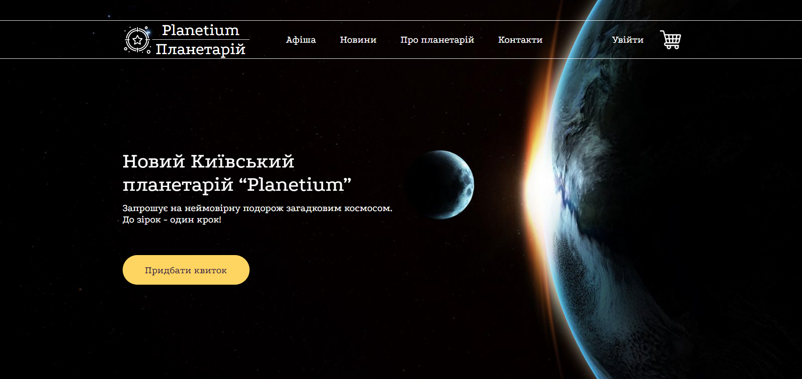

# PlanetariumDJangoProject
> This is an e-commerce Django project of Planetarium.
> Live demo [_here_](https://planetaruim.pythonanywhere.com/).

## Table of Contents
* [General Info](#general-information)
* [Technologies Used](#technologies-used)
* [Features](#features)
* [Screenshots](#screenshots)
* [Setup](#setup)
* [Usage](#usage)
* [Project Status](#project-status)
* [Acknowledgements](#acknowledgements)

## General Information
- Project consists of 7 applications (Account, Administrator, Events, Main, News, Order and User) all of which have their own have different functionalities.
- This project was created for the completion of KPI course.

## Technologies Used
- Python
- Django
- SQLite
- HTML
- JavaScript
- CSS

## Features
- Project has small information about Planetarium, sales, halls, news of space world ans manty more.
- You can review events, sort or filter them, pick date to buy tickets, add them to cart, edit them in cart, submit payment as an unregistered user.
- You can create account, edit it, add events to favourites, review history of your shopping as a registered user.
- An admin can ban and unban users, edit information about events.
- A pleasant design of site also makes your experience more significant.

## Screenshots

## Setup
All requirements are written in the requirements.txt file.

## Usage
You can use this project as another example Django projects. As many different features of online commerce were coded, you can try it out and have a reference for your future projects.

## Project Status
Project is:  _complete_.

## Acknowledgements
This project came to life thanks to:
- [Yuliia](https://github.com/JuliManhupli).
- [Anne](https://github.com/akaugustkropyva).
